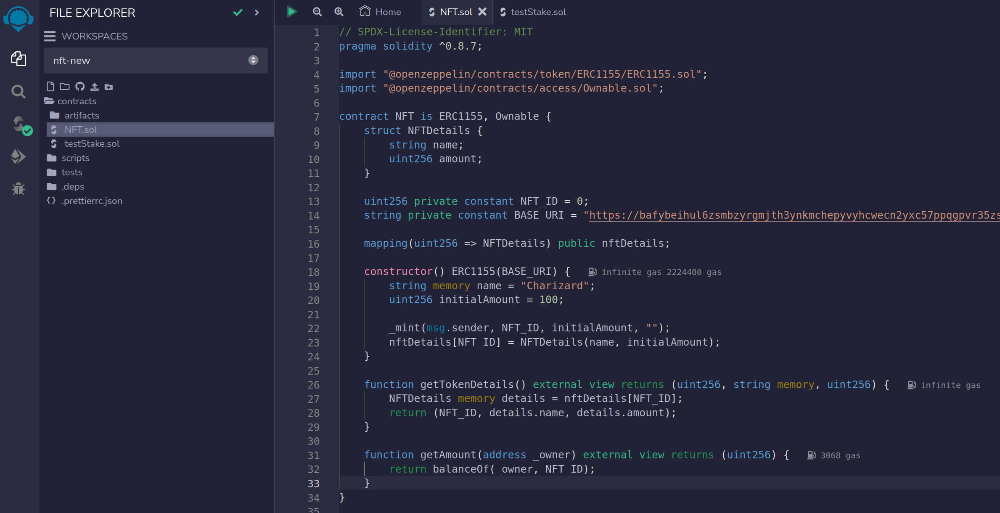
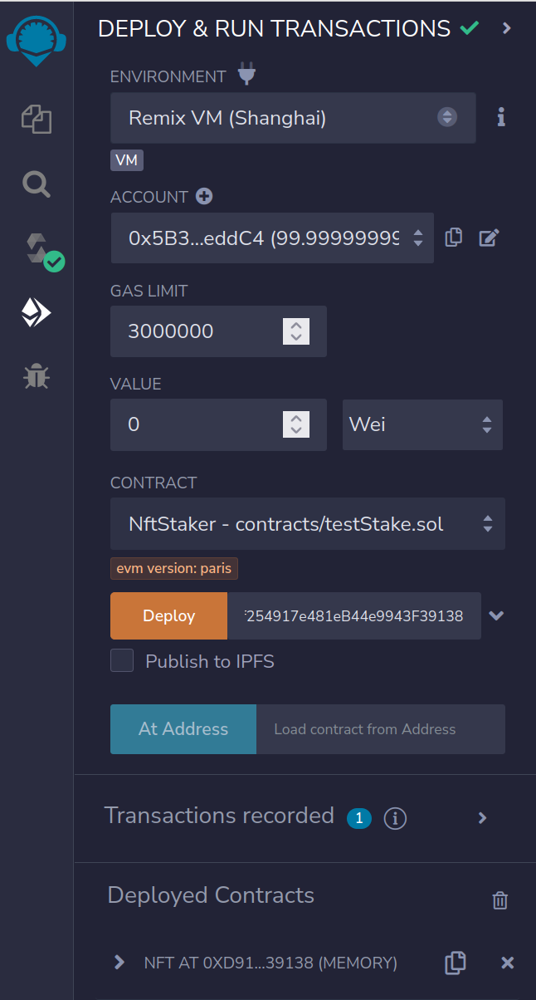
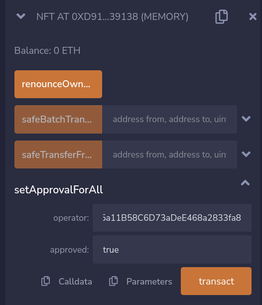
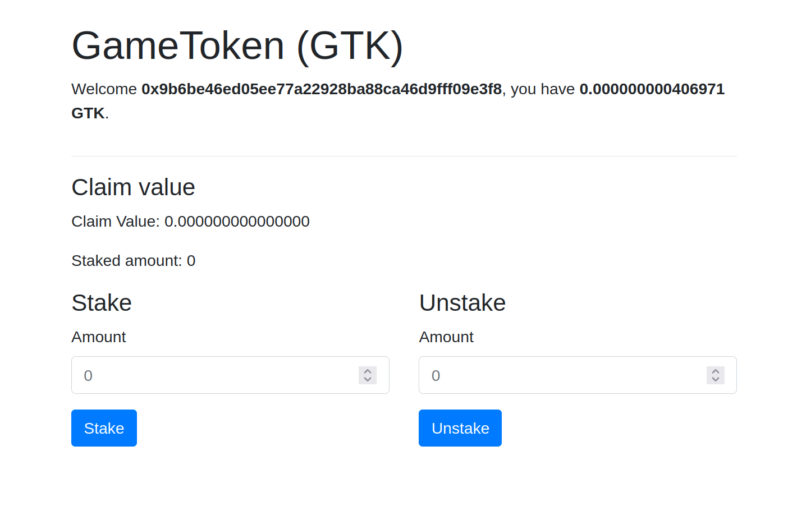
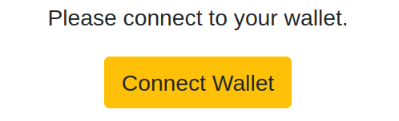

# NFT Staking App

This document aims to guide developers through the process of continuing the development of the Stake NFT application. It provides an overview of the current source code structure, best practices to adhere to, and steps to deploy new features.

<div align="center">
    
</div>

### Prerequisites

- Prerequisites for the development environment:
  - Install `Node.js` and `npm`.
  - Have knowledge of React, Ethereum, and Solidity.

## Contents

### 1. **Understanding Stake NFT and ERC-20/ERC-1155**

- **NFT**: An abbreviation for **_"Non-Fungible Token,"_** an blockchain-based token representing a unique and indivisible digital asset or object. NFTs cannot be substituted and are commonly used to verify ownership and trade unique digital assets.
- **Stake NFT Definition:**

  - **Stake:** In the context of finance and blockchain, **_"stake"_** refers to users depositing a certain amount of money or digital assets to participate in a blockchain network or protocol. This action is often done to ensure the security and safety of the network, as well as to receive rewards or benefits during transactions and data sharing.

  - **Stake NFT:** This involves users staking one or more NFTs _(Non-Fungible Tokens)_ into a specific system or service. By doing this, users can receive benefits or rewards related to holding NFTs for a fixed period. Staking NFTs can be used to participate in activities such as gaming, NFT marketplaces, or decentralized finance _(DeFi)_ platforms on the blockchain.
  - **Example:** In the "NFT Staking" system, users can stake their NFTs to participate in trading and earn profits. These NFTs could be unique editions of artworks or other digital assets. Staking NFTs can help users earn additional tokens or benefits by holding NFTs for a specified time period.

- **ERC-20 and ERC-1155 Definitions:**
  **ERC-20 Token** is a standard for tokens on the Ethereum blockchain platform. ERC-20 stands for _"Ethereum Request for Comments 20,"_ and it's a proposed standard protocol for creating and managing tokens based on the Ethereum blockchain. ERC-20 tokens are commonly used to represent various assets or values on the blockchain and function similarly to currency.

  - **Key Characteristics of ERC-20 Tokens:**

    1. **Transferable:** ERC-20 tokens can be easily transferred from one Ethereum wallet address to another through transactions.

    2. **Divisibility:** Each ERC-20 token can be divided into smaller units, allowing for precise transaction quantities.

    3. **Interoperability:** ERC-20 tokens follow a common standard, making them easily interact with various services and applications on the Ethereum platform.

    4. **Decimals:** Each ERC-20 token has a "decimals" parameter that determines the number of decimal places the token can be divided into. For example, if decimals = 18, the token can be divided into 18 decimal places.

    5. **Total Supply:** Each ERC-20 token has a predetermined maximum supply defined in the smart contract.

    6. **Balance Inquiry:** Users can check their ERC-20 token balances using wallet services or blockchain explorers.

    7. **Standard Functions:** ERC-20 tokens adhere to a set of standard functions, including `transfer` (token transfer), `balanceOf` (view balance), and more.

  **ERC-1155 Token** is an advanced standard for creating and managing various types of assets on the Ethereum blockchain platform. Introduced after ERC-20, ERC-1155 provides the ability to batch multiple types of assets within the same smart contract, resulting in higher efficiency and flexibility.

  - **Key Features of ERC-1155 Tokens:**

    1. **Multi-Token Standard:** ERC-1155 allows a single smart contract to create and manage multiple types of assets simultaneously. This optimizes smart contract deployment and management.

    2. **Economic Efficiency:** Compared to deploying separate smart contracts for each asset type, ERC-1155 saves gas costs and optimizes network resources.

    3. **Batch Operations:** ERC-1155 enables performing multiple operations involving multiple asset types in a single transaction, reducing latency and gas costs.

    4. **Flexibility:** Each token within an ERC-1155 contract can adhere to both ERC-20 and ERC-721 standards, enabling a wide range of applications from simple tokens to NFT issuance.

    5. **Batch Transfers:** Users can transfer multiple asset types in a single transaction, enhancing user experience.

    6. **Single Contract:** All ERC-1155-related tokens and assets are managed within a single smart contract, reducing the complexity of managing multiple contracts.

<div align="center">
    
</div>

- **Project Connections:**

  - **Staking and Belonging:** ERC-1155 tokens represent NFT assets that users can stake and accumulate value.
  - **Reward Distribution:** ERC-20 tokens are used to distribute rewards for users participating in staking. ERC-1155 NFTs can serve as the formal participation element in the staking process and value appreciation.

### 2. **Understanding the Current Source Code**

- **Overview of Project Structure and Components**

  The project follows a well-structured design with several crucial components for implementing staking functionality and managing NFT assets on the Ethereum network. Below is an overview of the project structure and key components:

  - **Smart Contracts:**
    In the project, smart contracts play a significant role. These contain the code that defines the rules and actions the system will automatically execute. In this case, smart contracts are used to implement staking functionality and manage NFT assets.

  - **User Interface (UI):**
    This is where users can view information about assets, perform staking and unstaking actions, and track their rewards. The UI provides an intuitive interface for interacting with the system.

  - **Ethers API Interfacing Functions:**
    In the project, the Ethers API is used to interact with the Ethereum blockchain from the user interface. This allows sending and receiving information from smart contracts, performing transactions, and updating data on the blockchain.

  - **Functionality Logic Processing:**
    The functional logic of the project includes actions such as staking, unstaking, and reward calculation. This is a crucial part that determines how the system operates and interacts with other components.

  Understanding the project's structure and key components helps us grasp how each part relates to the staking functionality and NFT asset management, which aids in effectively deploying and developing the project.

- **Important Libraries and Dependencies:**

  - **OpenZeppelin Contracts:** This is a library containing pre-built and security-audited smart contracts. OpenZeppelin Contracts provides standard contracts and utility features for deploying common functionalities like staking and NFT management.

  - **ethers.js:** Similar to web3.js, the ethers.js library also provides APIs for interacting with Ethereum. It's considered lightweight and has a more readable syntax, making development and interaction with smart contracts more convenient.

  - **React:** The React library helps you build the user interface (UI) for your project. With its readable syntax and component reusability, React is a popular choice for creating web project UIs.

### 3. Smart Contract Programming

**NFT Smart Contract**

In the code snippet below, an NFT smart contract is implemented based on the ERC1155 standard. Let's dive into the details of the structure and functions of this contract:

```
// SPDX-License-Identifier: MIT
pragma solidity ^0.8.7;

import "@openzeppelin/contracts/token/ERC1155/ERC1155.sol";
import "@openzeppelin/contracts/access/Ownable.sol";

contract NFT is ERC1155, Ownable {
    // Structure to store NFT details
    struct NFTDetails {
        string name;
        uint256 amount;
    }

    // Unique ID of the NFT
    uint256 private constant NFT_ID = 0;

    // IPFS base address for NFT details
    string private constant BASE_URI = "https://bafybeihul6zsmbzyrgmjth3ynkmchepyvyhcwecn2yxc57ppqgpvr35zsq.ipfs.dweb.link/{id}.json";

    // Mapping to store details of each NFT
    mapping(uint256 => NFTDetails) public nftDetails;

    constructor() ERC1155(BASE_URI) {
        // Name and initial amount of the NFT
        string memory name = "Charizard";
        uint256 initialAmount = 100;

        // Create the NFT and assign it to the deployer
        _mint(msg.sender, NFT_ID, initialAmount, "");
        nftDetails[NFT_ID] = NFTDetails(name, initialAmount);
    }

    // Return details of the NFT
    function getTokenDetails() external view returns (uint256, string memory, uint256) {
        NFTDetails memory details = nftDetails[NFT_ID];
        return (NFT_ID, details.name, details.amount);
    }

    // Return the amount of NFTs owned by the user
    function getAmount(address _owner) external view returns (uint256) {
        return balanceOf(_owner, NFT_ID);
    }
}
```

**Description:**

- This NFT Smart Contract implements an NFT based on the ERC1155 standard.
- Upon deployment, the contract will create an NFT with a unique ID and assign it to the deploying address.
- The `NFTDetails` structure stores the name and quantity of the NFT.
- `BASE_URI` is the IPFS base address for the detailed information of the NFT.
- The `getTokenDetails()` function returns the detailed information of the NFT, including ID, name, and quantity.
- The `getAmount(address _owner)` function returns the quantity of NFTs owned by the `_owner` address.

**NftStaker Smart Contract with Staking and Claiming NFTs**

Below is a NftStaker smart contract that allows users to stake and claim NFTs, along with a description of its important functions.

```
// SPDX-License-Identifier: MIT
pragma solidity ^0.8.7;

import "@openzeppelin/contracts/token/ERC20/ERC20.sol";
import "@openzeppelin/contracts/token/ERC1155/IERC1155.sol";
import "@openzeppelin/contracts/token/ERC1155/utils/ERC1155Holder.sol";
import "@openzeppelin/contracts/access/Ownable.sol";

contract NftStaker is ERC20, ERC1155Holder, Ownable {
    // Event when a user stakes NFT
    event NftStaked(address indexed user, uint256 tokenId, uint256 amount);

    // Event when a user unstakes NFT
    event NftUnstaked(address indexed user, uint256 tokenId, uint256 amount);

    // Event when a user claims reward
    event RewardClaimed(address indexed user, uint256 rewardAmount);

    // Link to the NFT (ERC1155) smart contract
    IERC1155 public parentNFT;

    // Reward rate for staking
    uint256 public rewardRate = 100000;

    // Token value
    uint256 public tokenValue = 1;

    // Total pool size of NFTs
    uint256 public totalPoolSize = 0;

    // Default NFT ID
    uint256 public defaultTokenId = 0;

    // Structure to store staking information
    struct Stake {
        uint256 tokenId;
        uint256 amount;
        uint256 timestamp; // Store the staking start timestamp
    }

    // Mapping to store staking information of each user
    mapping(address => Stake) public stakes;

    // Modifier to check if the user has enough NFTs to stake
    modifier hasSufficientNFTBalance(address account, uint256 amount) {
        require(
            parentNFT.balanceOf(account, defaultTokenId) >= amount &&
                amount >= 0,
            "Insufficient NFT balance"
        );
        _;
    }

    constructor(address _nft) ERC20("GameToken", "GTK") {
        parentNFT = IERC1155(_nft);
    }

    // Function to allow users to stake NFTs
    function stake(uint256 _amount)
        external
        hasSufficientNFTBalance(msg.sender, _amount)
    {
        stakes[msg.sender] = Stake(defaultTokenId, _amount, block.timestamp);
        parentNFT.safeTransferFrom(
            msg.sender,
            address(this),
            defaultTokenId,
            _amount,
            "0x00"
        );
        totalPoolSize += _amount;
        emit NftStaked(msg.sender, defaultTokenId, _amount);
    }

    // Function to allow users to unstake NFTs
    function unstake(uint256 _amount)
        external
        hasSufficientNFTBalance(msg.sender, _amount)
    {
        uint256 reward = calculateRewards(
            _amount,
            stakes[msg.sender].timestamp
        );

        _mint(msg.sender, reward);

        parentNFT.safeTransferFrom(
            address(this),
            msg.sender,
            stakes[msg.sender].tokenId,
            _amount,
            "0x00"
        );

        if (stakes[msg.sender].amount > _amount) {
            stakes[msg.sender].timestamp = block.timestamp; // Reset the staking start timestamp
            stakes[msg.sender].amount -= _amount;
            totalPoolSize -= _amount;
        } else if (stakes[msg.sender].amount == _amount) {
            delete stakes[msg.sender];
        }
        emit NftUnstaked(msg.sender, stakes[msg.sender].tokenId, stakes[msg.sender].amount);
    }

    // Function to allow users to claim rewards
    function claim() external hasSufficientNFTBalance(msg.sender, 0) {
        uint256 reward = calculateRewards(
            stakes[msg.sender].amount,
            stakes[msg.sender].timestamp
        );

        _mint(msg.sender, reward);
        stakes[msg.sender].timestamp = block.timestamp; // Reset the staking start timestamp
        emit RewardClaimed(msg.sender, reward);
    }

    // Function to calculate rewards based on staking information
    function calculateRewards(uint256 stakedNFTs, uint256 stakingStartTimestamp)
        internal
        view
        returns (uint256)
    {
        uint256 stakingDuration = block.timestamp - stakingStartTimestamp;
        require(stakingDuration > 0, "Staking duration must be greater than 0");
        require(tokenValue > 0, "Token value must be greater than 0");

        return
            (stakedNFTs * rewardRate * stakingDuration * tokenValue) /
            totalPoolSize;
    }

    // Function to return the amount of NFTs staked by the user
    function getStakedNFTs() public view returns (uint256) {
        return stakes[msg.sender].amount;
    }

    // Function to return the staking duration of the user
    function getStakingDuration() public view returns (uint256) {
        if (stakes[msg.sender].timestamp == 0)
            return 0;
        return block.timestamp - stakes[msg.sender].timestamp;
    }
}
```

**Description:**

- The `NftStaker` smart contract allows users to stake and claim NFTs based on ERC20 and ERC1155 standards.
- Users can stake NFTs into the contract and then later unstake and claim rewards based on time and the amount of staked NFTs.
- The contract inherits from OpenZeppelin's `ERC20`, `ERC1155Holder`, and `Ownable` smart contracts for managing staking, NFT holding, and ownership respectively.
- The contract uses the ERC20 standard to create a token named "GameToken" (GTK) for representing rewards.
- Users must ensure that they have enough NFTs to stake before calling the `stake`, `unstake`, or `claim` functions.
- Information about staking and rewards is calculated based on parameters like `rewardRate`, `tokenValue`, and `stakingDuration`.

### _Guide to Deploying the Smart Contracts_

<div align="center">
    
</div>

**Step 1: Access Remix Ethereum**

1. Open a web browser and go to the address: [https://remix.ethereum.org/](https://remix.ethereum.org/)

**Step 2: Create Smart Contracts**

1. Click on the "File" button in the top left corner and select "New File."
2. Create a new file with any name you prefer, for example: "NftStaker.sol."
3. Paste the smart contract source code into the newly created file.

**Step 3: Select Compiler and Deploy**

1. Click on the "Solidity Compiler" tab in the top right corner.
2. Select the appropriate Solidity version for the smart contract source code.
3. Click the "Compile" button to compile the source code.

**Step 4: Deploy Smart Contracts**

1. Click on the "Deploy & Run Transactions" tab in the top right corner.
2. Choose a deployment environment (e.g., JavaScript VM, Injected Web3, or a real Ethereum network).
3. Under the "Deploy" section below, select the smart contract you want to deploy from the list of compiled contracts.
4. Enter the necessary deployment parameters (e.g., NFT address, rewardRate, tokenValue, ...).
5. Click the "Deploy" button to deploy the smart contract.

<div align="center">
    
</div>

**Step 5: Confirm the Transaction**

1. If you are deploying on the real Ethereum network, a transaction confirmation window will appear.
2. Confirm the transaction by selecting the wallet type, entering your password, and confirming.

**Step 6: Wait for Deployment to Complete**

1. After confirming, wait for the deployment process to complete. Remix will display the hash of the deployment transaction.

**Step 7: Manage the Smart Contracts**

1. Once the smart contract is successfully deployed, you can manage and interact with it through the defined functions within the smart contract.

**Note:**

- After deploying the two smart contracts, you need to call the `setApprovalForAll` function for `NFTStaker` within the `NFT` smart contract.
  <div align="center">
    
</div>
- The account used to deploy the `NFT` contract will have 100 NFT Tokens.
- During the deployment process on the real Ethereum network, you will need Ether to cover transaction fees. Make sure you are connected to an Ethereum wallet or the real Ethereum network before deploying.

### 4. **Getting Started**

### Starting the NFT Staking Project

Here are concise steps to get started with your NFT Staking project:

**Step 1: Clone the Project from GitHub**

- Open a terminal and run `git clone https://github.com/vietddude/stake-nft.git`.

**Step 2: Install Dependencies**

- Inside the project directory, run `npm install` to install the dependencies.

**Step 3: Set Up Environment Variables**

- In the `.\src\contracts` directory, edit the `<*>-abi.json` and `<*>-address.json` files to connect to the respective smart contracts.

### Starting the Development

- Use `npm start` to launch the project in the development environment.

<div align="center">
    
</div>

### 5. Key Features

Below is a description of the key features in the application and the workflow of each feature:

- **Display Token Information and Balance:**
  After successfully connecting their wallet, users will see information about the token and their balance at the top of the page. The token name and icon will also be displayed.

- **Stake (Initiate Stake):**
  Users can initiate staking by inputting the quantity of NFT tokens and clicking the "Stake" button. When NFT tokens are sent for staking, a transaction will be initiated, and users will see a notification indicating a pending transaction.

- **Unstake (Initiate Unstake):**
  Users can initiate unstaking by inputting the quantity of NFT tokens and clicking the "Unstake" button. A transaction will be initiated, and users will see a notification indicating a pending transaction.

- **Claim (Claim Rewards):**
  Once users have staked NFT tokens, they can click the "Claim" button to receive rewards. Rewards will be calculated based on the quantity of NFT tokens staked and the duration of the stake. A transaction will be initiated, and users will see a notification indicating a pending transaction.

- **Display Staking Information:**
  At the bottom of the page, information about the quantity of NFT tokens being staked and the duration of the stake will be displayed.

### Workflow of Key Features:

1. **Connect Wallet:**

<div align="center">
    
</div>

- User clicks the "Connect Wallet" button.
- MetaMask (or another wallet) popup appears requesting wallet connection.
- User confirms the connection.
- The application displays wallet information and balance.

2. **Stake (Initiate Stake):**

   - User inputs the quantity of NFT tokens to be sent for staking.
   - User clicks the "Stake" button.
   - The application creates a stake transaction and displays a pending transaction notification.
   - The stake transaction is sent to the Ethereum network.
   - Upon confirmation, the quantity of NFT tokens in the transaction is added to the staked amount.

3. **Unstake (Initiate Unstake):**

   - User inputs the quantity of NFT tokens to be unstaked.
   - User clicks the "Unstake" button.
   - The application creates an unstake transaction and displays a pending transaction notification.
   - The unstake transaction is sent to the Ethereum network.
   - Upon confirmation, the quantity of NFT tokens in the transaction is subtracted from the staked amount.

4. **Claim (Claim Rewards):**

   - User clicks the "Claim" button.
   - The application calculates rewards based on the quantity of NFT tokens staked and the duration of staking.
   - The application creates a claim transaction and displays a pending transaction notification.
   - The claim transaction is sent to the Ethereum network.
   - Upon confirmation, the reward is added to the user's balance.

5. **Display Staking Information:**
   - The application continuously updates the quantity of NFT tokens being staked and the duration of staking.

### Explanation of Code for Key Features in the Application:

- **Connect Wallet:**

  In the `_connectWallet()` function, the application uses `window.ethereum.request()` to request the user to connect their wallet. After the user accepts the connection, the `_initialize()` function is called to initialize the app with the selected wallet address and create event listeners for account changes.

- **Display Token Information and Balance:**

  The `_getTokenData()` function calls the `Stake` contract to retrieve information about the token's name and icon. The `_updateBalance()` function uses the `Stake` contract to retrieve the user's balance.

- **Stake (Initiate Stake):**

  In the `_stake(amount)` function, the user inputs the quantity of tokens to stake. This function calls the `stake(amount)` function of the `Stake` contract to perform the stake. After the transaction is confirmed, `_getStakeData()` is called to update the information about the quantity of NFT tokens being staked.

- **Unstake (Initiate Unstake):**

  In the `_unstake(amount)` function, the user inputs the quantity of tokens to unstake. This function calls the `unstake(amount)` function of the `Stake` contract to perform the unstake. After the transaction is confirmed, `_getStakeData()` and `_getTokenData()` are called to update the information.

- **Claim (Claim Rewards):**

  The `_claim()` function calls the `claim()` function of the `Stake` contract to claim rewards. After the transaction is confirmed, `_getStakeData()` is called to update the information about the quantity of NFT tokens being staked.

- **Display Staking Information:**

  In the `_getStakeData()` function, the `getStakedNFTs()` and `getStakingDuration()` functions of the `Stake` contract are called to retrieve information about the quantity of NFT tokens being staked and the duration of staking. This information is updated in the state to be displayed to the user.

Additionally, there are functions like `_initializeEthers()` to initialize ethers and contracts, `_startPollingData()` to start polling the balance, and `_stopPollingData()` to stop polling when the component is unmounted.

In summary, each key feature of the application involves interacting with the `Stake` contract through ethers and displaying the corresponding results to the user. Transactions are created, sent, and confirmed on the Ethereum network to perform stake, unstake, and claim operations.

### 6. Adding New Features

Here are step-by-step guides for deploying new features within the application:

**1. Adding Contracts and Displaying New Information:**

- **Description and Purpose:**
  Suppose you want to add a new contract to manage different types of NFTs and display the quantity of each type in the user interface.

  - **Contract and UI Changes:**

    - Deploy a new contract similar to `NFT` for each NFT type.
    - Update the user interface to display information about each NFT type by calling functions of the new NFT contracts.

  - **Example Code Modifications:**
    - In UI components, update relevant sections to display information about different NFT types.

**2. Adding New Wallet and Handling Transactions:**

- **Description and Purpose:**
  Suppose you want to integrate a new type of wallet so that users can use it to stake and unstake.

- **Contract and UI Changes:**

  - Add a contract for the new wallet type.
  - Update the user interface to allow users to choose the wallet type they want to use.

- **Example Code Modifications:**

  - In UI components, update the wallet selection and perform transactions with the new wallet type.

**3. Staking Multiple NFT Types:**

- **Description and Purpose:**
  Want to allow users to stake multiple different types of NFTs simultaneously and update information for each NFT type.

- **Contract and UI Changes:**

  - Update the `Stake` contract to support multiple NFT types.
  - Update the user interface to allow users to select the NFT type when performing stake and unstake operations.

- **Example Code Modifications:**

  - In UI components, update the NFT type selection when performing stake and unstake operations.

**4. Adding New Information:**

- **Description and Purpose:**
  Want to add new information about reward rates, token values, and total pool size.

- **Contract and UI Changes:**

  - Add new getter functions to the `Stake` contract to retrieve the new information.
  - Update the user interface to display the new information.

- **Example Code Modifications:**

  - In UI components, update the display of the new information.

**5. Testing and Review:**

Before deployment, you should:

- **Test Thoroughly:** Test the application with various use cases to ensure the stability and correctness of the new features.
- **Integration Testing:** Test the integration between the user interface and the new smart contracts to ensure compatibility and accuracy.
- **Security Review:** Ensure that changes in the smart contracts are carefully reviewed to avoid security vulnerabilities.

All changes and updates should be done through a careful testing process to ensure the stability and accuracy of the application after deploying new features.

### **Example of Adding the New Feature "Staking Multiple NFT Types"**

1.  **Contract Changes for Staking Multiple NFT Types:**

- **Description and Purpose:** To allow users to stake multiple types of NFTs.

- **Contract Changes:**

  - Add a mapping to store the staked NFT quantity for each type.
  - Modify the `stake` function to accept an additional parameter `tokenId` for the NFT type.

```
 contract NftStaker is ERC20, ERC1155Holder, Ownable {
     // Existing code...

     mapping(address => mapping(uint256 => uint256)) public stakedNFTsByType;

     function stake(uint256 _amount, uint256 _tokenId)
         external
         hasSufficientNFTBalance(msg.sender, _amount)
     {
         stakes[msg.sender] = Stake(_tokenId, _amount, block.timestamp);
         parentNFT.safeTransferFrom(
             msg.sender,
             address(this),
             _tokenId,
             _amount,
             "0x00"
         );
         totalPoolSize += _amount;

         // Update the stakedNFTsByType mapping
         stakedNFTsByType[msg.sender][_tokenId] += _amount;

         emit NftStaked(msg.sender, _tokenId, _amount);
     }

     // Existing code...
 }
```

**2. Updating the User Interface:**

- **Description and Purpose:** Update the user interface to allow users to choose the NFT type when performing stake and unstake operations.

- **UI Changes:**

  - Update the `Stake` and `Unstake` components to allow users to select the NFT type when performing the actions.

```
    // ... Existing code ...

    export class Stake extends React.Component {
        // Existing code...

        render() {
            return (
                <div>
                    {/* ... Existing UI elements ... */}
                    <select
                        value={this.state.selectedTokenId}
                        onChange={this.handleTokenChange}
                    >
                        <option value={0}>Type 1</option>
                        <option value={1}>Type 2</option>
                        {/* Add options for other types... */}
                    </select>
                    <button onClick={() => this.stake()}>Stake</button>
                </div>
            );
        }
    }

    export class Unstake extends React.Component {
        // Existing code...

        render() {
            return (
                <div>
                    {/* ... Existing UI elements ... */}
                    <select
                        value={this.state.selectedTokenId}
                        onChange={this.handleTokenChange}
                    >
                        <option value={0}>Type 1</option>
                        <option value={1}>Type 2</option>
                        {/* Add options for other types... */}
                    </select>
                    <button onClick={() => this.unstake()}>Unstake</button>
                </div>
            );
        }
    }

    // ... Existing code ...
```

**3. Updating the Example Code:**

- **Description and Purpose:** Update the transaction handling functions to allow users to choose the NFT type when performing stake and unstake actions.

- **Updated Example Code:**

  - In the `_stake` and `_unstake` functions, update the calls to the `stake` and `unstake` functions of the contract with the additional parameter `tokenId`.

```
    // ... Existing code ...

    export class Dapp extends React.Component {
        // ... Existing code ...

        async _stake(amount) {
            try {
                this.setState({ stakingDuration: 0 });
                const tx = await this._staker.stake(amount, this.state.selectedTokenId);
                // ... Existing code ...
            } catch (error) {
                // ... Existing code ...
            }
        }

        async _unstake(amount) {
            try {
                this.setState({ stakingDuration: 0 });
                const tx = await this._staker.unstake(amount, this.state.selectedTokenId);
                // ... Existing code ...
            } catch (error) {
                // ... Existing code ...
            }
        }

        // ... Existing code ...
    }

    // ... Existing code ...
```

### 7. **Handling Transactions**

To manage Ethereum transactions and interact with the blockchain, you need to use the `ethers.js` library, a popular library for interacting with the Ethereum blockchain. Below is a guide on how to send transactions, listen for transaction events, and handle transaction errors in your application.

1.  **Sending Transactions:**

    To send an Ethereum transaction, you need to use the `sendTransaction` method of the `Signer` object. Here's how you can send a transaction:

         ```
         // Assuming you have a connected Signer instance
         async function sendTransaction(toAddress, value) {
             try {
                 const txResponse = await signer.sendTransaction({
                     to: toAddress,
                     value: ethers.utils.parseEther(value.toString()), // Convert value to wei
                 });
                 console.log("Transaction sent:", txResponse.hash);
                 return txResponse.hash;
             } catch (error) {
                 console.error("Transaction error:", error);
                 throw error;
             }
         }
         ```

2.  **Tracking Transaction Events:**

    To monitor events related to a transaction, you can utilize the `wait` method of the `TransactionResponse` object. Below is how you can track transaction events:

        ```
        async function waitForTransaction(txHash) {
            try {
                const txReceipt = await provider.waitForTransaction(txHash);
                if (txReceipt.status === 1) {
                    console.log("Transaction successful!");
                    // Handle success case
                } else {
                    console.log("Transaction failed!");
                    // Handle failure case
                }
            } catch (error) {
                console.error("Transaction error:", error);
                throw error;
            }
        }
        ```

3.  **Handling Transaction Errors:**

    When sending transactions, various types of errors can occur, including user-rejected transactions, insufficient ETH to cover gas fees, smart contract errors, and more. Here's how you can handle transaction errors:

    ```
    	async function sendTransaction(toAddress, value) {
    	    try {
    	        // ... Sending transaction code ...

    	        // Wait for the transaction to be mined
    	        const txReceipt = await txResponse.wait();

    	        if (txReceipt.status === 1) {
    	            console.log("Transaction successful!");
    	            // Handle success case
    	        } else {
    	            console.log("Transaction failed!");
    	            // Handle failure case
    	        }
    	    } catch (error) {
    	        if (error.code === ethers.utils.Logger.errors.CALL_EXCEPTION) {
    	            console.log("Contract execution error!");
    	            // Handle contract execution error
    	        } else if (error.code === ethers.utils.Logger.errors.TRANSACTION_REVERTED) {
    	            console.log("Transaction reverted!");
    	            // Handle transaction reverted error
    	        } else if (error.code === ERROR_CODE_TX_REJECTED_BY_USER) {
    	            console.log("Transaction rejected by user!");
    	            // Handle user rejection
    	        } else {
    	            console.error("Transaction error:", error);
    	            // Handle other errors
    	        }
    	        throw error;
    		}
    	}
    ```

### 8. **Testing and Deployment**

After implementing new features or making changes to your NFT staking application, it's important to thoroughly test and then deploy the updated application to a live Ethereum network. Here's a guide on how to test and deploy your application:

1. **Testing:**

- **Unit Testing:** Write unit tests to ensure that the new features and changes are functioning as expected. Use testing frameworks like Truffle, Hardhat, or Waffle to create and run tests for your smart contracts.

- **Integration Testing:** Test the integration of your smart contracts with the frontend application. Check that the frontend properly interacts with the smart contracts and displays accurate information.

- **User Testing:** Conduct user testing to gather feedback from actual users. This can help you identify any usability issues or bugs that may have been missed during development.

2. **Deploying to Testnets:**

   Before deploying to the main Ethereum network, consider deploying your updated application to Ethereum testnets (Rinkeby, Ropsten, Kovan) to ensure everything is working correctly. Here's how you can deploy to a testnet:

   - Use Truffle, Hardhat, or Remix to deploy your smart contracts to a testnet. Update the deployment scripts or Remix configurations to target the desired testnet.

   - Deploy your frontend application to a web hosting service or platform like GitHub Pages, Netlify, or Vercel. Update the contract addresses and ABIs in your frontend code to point to the deployed contracts on the testnet.

   - Test the frontend application on the testnet to ensure that it properly interacts with the deployed smart contracts.

3. **Deployment to Mainnet:**

   Once you're confident in the functionality and stability of your application, you can proceed to deploy it to the Ethereum mainnet. Here's how you can do it:

   - Update the deployment scripts or Remix configurations to target the Ethereum mainnet.

   - Prepare enough Ether to cover the gas fees required for deploying the smart contracts and interacting with them on the mainnet.

   - Deploy your smart contracts to the Ethereum mainnet using the same methods as you did for the testnet.

   - Deploy the updated frontend application to a web hosting service or platform, making sure to update contract addresses and ABIs to point to the mainnet deployment.

   - Inform your users about the deployment to the mainnet and provide them with the necessary information to interact with the application.

4. **Monitoring and Maintenance:**

   After deployment, continuously monitor the application for any issues or unexpected behavior. Address any user-reported problems promptly and consider releasing updates as needed.

   Regularly review your smart contracts for security vulnerabilities and keep them up-to-date with best practices.

   By following these steps, you can ensure that your NFT staking application is thoroughly tested and properly deployed to provide a secure and user-friendly experience for your users on the Ethereum network.

_...ongoing_ 🚧
